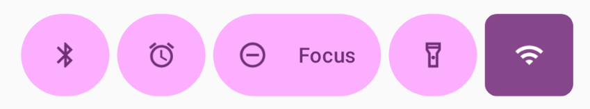

# Material 3 Button Showcase with Lottie & Neumorphism ✨

This project is a **comprehensive showcase of Material 3 Buttons, Expressive Button Groups, Lottie Animations**, and **Neumorphism UI** using **Jetpack Compose**. It is designed to help Android developers understand the usage, styling, and interaction capabilities of modern UI components provided by **Material Design 3 (M3)**.

---

## 🚀 Features Explored

### 🧩 Material 3 Buttons

All types of Material 3 buttons have been implemented and demonstrated:

- `Button`
- `ElevatedButton`
- `FilledTonalButton`
- `OutlinedButton`
- `TextButton`
- `IconButton`
- `FilledIconButton`
- `FilledIconToggleButton`
- `ToggleButton`

Each button type is showcased with different use-cases and states (enabled, disabled, selected, etc.).

---

### 🎛️ Material 3 Expressive Button Groups

Material 3 Expressive Buttons provide more advanced interaction patterns. This project demonstrates:

- ✅ **Single Select Button Group**
- ✅ **Multi-Select Button Group**
- ✅ **Single Choice Segmented Button Row**
- ✅ **Multi Choice Segmented Button Row**
- ✅ **Split Button with Dropdown Menu**

These components are ideal for selections, filters, and action groups in modern Android UIs.

---

### 🎥 Demo Screenshots

|  
|  

---

### 📹 Demo Videos

| Feature | Video |
|--------|-------|
| Split Button with Dropdown Menu | https://github.com/user-attachments/assets/c7237004-6d79-42e1-9433-7c0f9f391482 |
| Multi-Select Button Group |https://github.com/user-attachments/assets/bde2651e-46ef-4e60-8563-eb123614c993  |
| Multi Choice Segmented Button Row |https://github.com/user-attachments/assets/f78aad54-68e4-4e58-a5dc-8c0cc290f0e9 |

---

### 🎨 Lottie Animations

This project also explores **Lottie animations** including:

- 🔧 How to implement Lottie in Jetpack Compose using `lottie-compose`
- 🌈 How to change the color of the entire animation
- 🎯 How to target and change colors of **individual parts** of the animation using `LottieDynamicProperties`

---

### 🧊 Neumorphism UI

Neumorphism is a hybrid design concept combining **Skeuomorphism** and **Flat Design**. It’s implemented using subtle:

- ☁️ Light shadows
- 🌑 Dark shadows
- 🎨 Soft backgrounds and rounded surfaces

This project demonstrates how to create **Neumorphic buttons** and containers using Compose modifiers.

---

## 🛠️ Built With

- **Jetpack Compose**
- **Material Design 3 (MaterialTheme 3)**
- **Compose Material 3 Expressive**
- **Lottie for Android**
- **Kotlin**
---

## 📚 Learning Outcomes

Through this project, you will:

- Understand the differences and use-cases for all types of M3 buttons.
- Learn how to use advanced button grouping features provided in Material 3 Expressive.
- Implement interactive UIs with **Split Buttons** and **Segmented Controls**.
- Add dynamic and beautiful **Lottie animations**, and customize their visuals.
- Create visually appealing UI using **Neumorphism** design principles.

---
